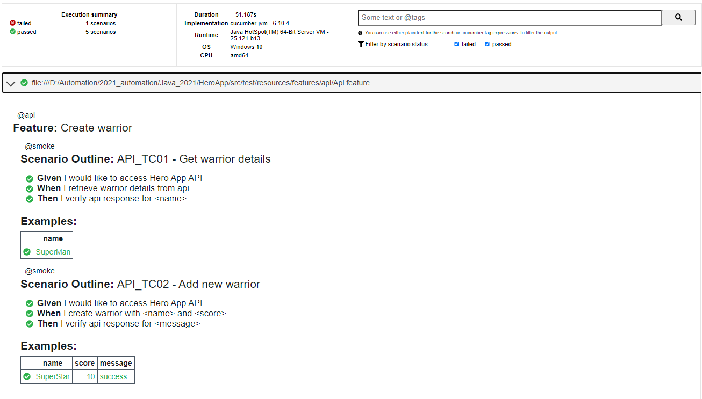
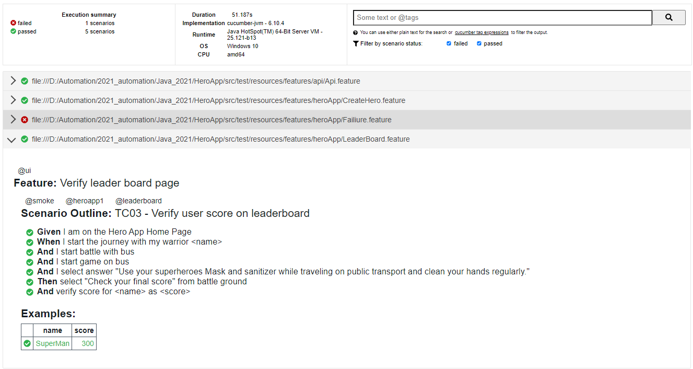
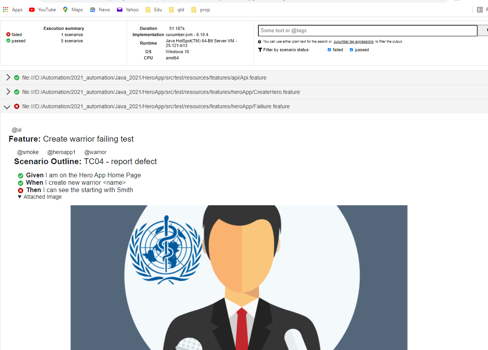

# Web & API Automation
### UI + API Automation Framework using : Maven - Java , Cucumber, Selenium, RestAssured

This Web Automation framework was developed using Java, Cucumber, Selenium, RestAssured and TestNG. 
For this Page Object Model design pattern was used so that to enhance test maintenance and to reduce code duplication.

#### How to clone the project:
    $ git clone https://github.com/dcwl2021/HeroApp.git
  ###### 

#### How to build and execute the project in different browsers

    $ mvn clean test -Denv.BROWSER=Chrome
    $ mvn clean test

#### Sample Cucumber report as below, 

