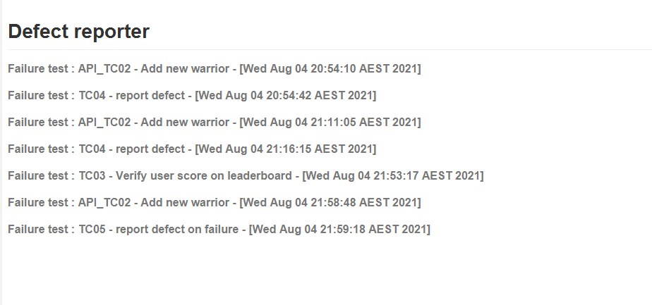

# Web & API BDD Automation framework
### UI + API Automation Framework using : Maven - Java , Cucumber, Selenium, RestAssured tools

This Web & Api Automation framework was developed using Java, Cucumber, Selenium, RestAssured and TestNG. Cucumber was used to write the tests in a simple format and to lead to BDD framework.
Reusable steps implemented so that to cover tests within less implementation & effort.

Integrated this framework with Jenkins to execute tests so that to cover CI and better visibility of execution.
But for this I used local Jenkins hence given the basic screenshots of it at the bottom of the file.

For this Page Object Model design pattern was used so that to enhance test maintenance and to reduce code duplication.

Cucumber reports was used to present final test results in detailed and user friendly format while capturing screenshots for failure tests.

Upon test failure - a record will be added to the 'DEFECT.md' file and a screenshot will be added to the Cucumber test results report.

####
####
####

#### How to clone the project:
    $ git clone https://github.com/dcwl2021/HeroApp.git
  ###### 

#### How to build and execute the project in different browsers

    $ mvn clean test -Denv.BROWSER=Chrome
  

#### Sample Cucumber report as below, 

####
#### Test results

####
#### Detailed test results

####
#### Failure test results

####
#### Defect report

### Further improvements

###### Can easily increase the test coverage
###### Extend the framework to cross browser testing
###### Extend the framework to support parallel test execution
###### Improve with reusable steps to cover more scenarios
###### Test data handling can be improved

# Jenkins integration with BDD Automation framework

